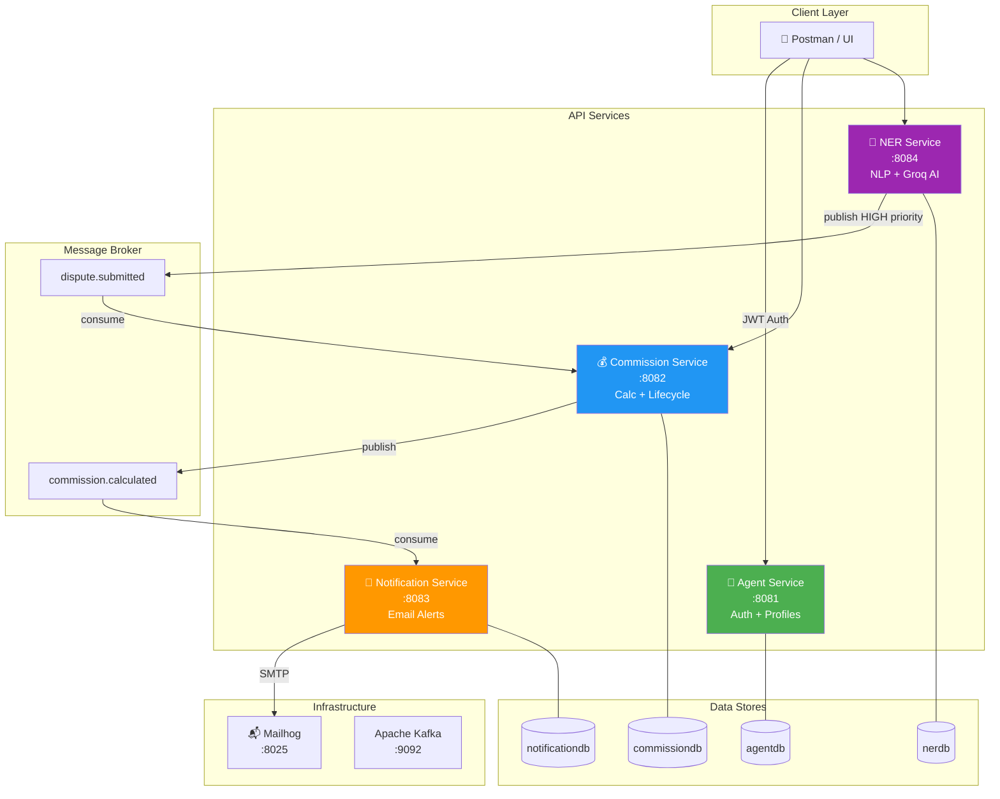

<div align="center">

# 🏥 Healthcare Commission Payout Notification System

**A production-style, event-driven microservices backend for US healthcare insurance commission tracking, payout notifications, and AI-powered dispute analysis.**

[](https://openjdk.org/)
[](https://spring.io/projects/spring-boot)
[](https://kafka.apache.org/)
[](https://www.mysql.com/)
[](https://www.docker.com/)
[](LICENSE)

[Architecture](#architecture-overview) •
[Services](#services) •
[Quick Start](#getting-started) •
[API Reference](#api-reference) •
[Design Decisions](#key-design-decisions)

</div>

---

## 🎯 What This Project Demonstrates

| Skill | Implementation |
|-------|---------------|
| **Microservices Architecture** | 4 independently deployable services with isolated databases |
| **Event-Driven Design** | Apache Kafka for async communication with DLQ support |
| **Security** | JWT stateless authentication with Spring Security + BCrypt |
| **AI/NLP Integration** | Stanford CoreNLP + Groq LLM for hybrid entity extraction |
| **Domain Modeling** | US healthcare insurance: agents, carriers, commissions, disputes |
| **API Design** | RESTful APIs with validation, pagination, filtering, Swagger docs |

---

## 📐 Architecture Overview



### Event Flow

```
Commission Payout Flow:
┌──────────┐    ┌────────────────┐    ┌─────────────────┐    ┌────────┐
│  Agent   │───▶│  Commission    │───▶│  Kafka Topic:   │───▶│ Notif. │───▶ 📧 Email
│ Register │    │  Calculate     │    │  commission.    │    │Service │    (Mailhog)
│ + Login  │    │                │    │  calculated     │    │        │
└──────────┘    └────────────────┘    └─────────────────┘    └────────┘

Dispute Analysis Flow:
┌──────────┐    ┌────────────────┐    ┌─────────────────┐    ┌────────┐
│ Dispute  │───▶│ Stanford NLP   │───▶│ Groq AI         │───▶│ Kafka  │───▶ Commission
│ Text     │    │ + Regex Extract│    │ Analysis        │    │(HIGH)  │    Service
│ Input    │    │                │    │                 │    │        │    (auto-flag)
└──────────┘    └────────────────┘    └─────────────────┘    └────────┘
```

---

## 🧩 Services

<details>
<summary><b>🔐 Agent Service (Port 8081)</b> — Authentication & Agent Management</summary>

### Responsibilities
- JWT-based stateless authentication using Spring Security
- BCrypt password encoding
- Agent registration with NPN (National Producer Number) validation
- Paginated agent listing

### Endpoints

| Method | Endpoint | Description | Auth |
|--------|----------|-------------|------|
| `POST` | `/api/agents/register` | Register new agent | ❌ |
| `POST` | `/api/agents/login` | Login → JWT token | ❌ |
| `GET` | `/api/agents/{npn}` | Get agent by NPN | ✅ |
| `GET` | `/api/agents` | List all agents (paginated) | ✅ |

### Database: `agentdb`

</details>

<details>
<summary><b>💰 Commission Service (Port 8082)</b> — Commission Lifecycle & Kafka Producer</summary>

### Responsibilities
- Submit commission records per agent per carrier per policy
- Business rule validation (duplicate prevention, amount > 0, status checks)
- Commission type support: `PERCENT`, `PMPM`, `PSPM`, `PMPY`, `PCPM`, `PSPY`, `PPPM`, `NA`
- Status lifecycle: `PENDING → CALCULATED → PAID`
- Publishes `commission.calculated` Kafka event on calculation
- Consumes `dispute.submitted` events to auto-flag commissions

### Endpoints

| Method | Endpoint | Description | Auth |
|--------|----------|-------------|------|
| `POST` | `/api/commissions` | Submit commission record | ✅ |
| `PUT` | `/api/commissions/{id}/calculate` | Calculate + publish Kafka event | ✅ |
| `PUT` | `/api/commissions/{id}/flag-dispute` | Flag for dispute review | ✅ |
| `GET` | `/api/commissions` | List (filter: agentNpn, status, month) | ✅ |
| `GET` | `/api/commissions/summary` | Payout summary by agent & month | ✅ |

### Database: `commissiondb`
### Kafka: Produces → `commission.calculated` / Consumes → `dispute.submitted`

</details>

<details>
<summary><b>📧 Notification Service (Port 8083)</b> — Kafka Consumer & Email Delivery</summary>

### Responsibilities
- Consumes `commission.calculated` Kafka events
- Sends payout notification emails via Mailhog (SMTP)
- Persists notification logs with `SENT` / `FAILED` status
- Error handling with failed notification tracking

### Endpoints

| Method | Endpoint | Description | Auth |
|--------|----------|-------------|------|
| `GET` | `/api/notifications` | Notification history (filter: agentNpn, status) | ✅ |

### Database: `notificationdb`
### Kafka: Consumes → `commission.calculated`

</details>

<details>
<summary><b>🧠 NER Service (Port 8084)</b> — AI-Powered Dispute Intelligence</summary>

### Responsibilities
- Stanford CoreNLP extracts: `PERSON`, `ORGANIZATION`, `LOCATION`, `DATE`
- Custom regex extracts: NPN (7-10 digit format), Policy ID (e.g., `EP-9921`)
- Groq AI (`llama3-8b-8192`) analyses dispute validity, recommends action, assigns priority
- Publishes `dispute.submitted` Kafka event for `HIGH` priority disputes
- Dispute lifecycle: `OPEN → UNDER_REVIEW → RESOLVED / DENIED`

### AI Pipeline

```
Dispute Text Input
       │
       ▼
┌──────────────────────────────────┐
│  Stanford CoreNLP                │
│  → PERSON, ORG, LOCATION, DATE  │
│  +                               │
│  Custom Regex                    │
│  → NPN, Policy ID               │
└──────────────┬───────────────────┘
               │
               ▼
┌──────────────────────────────────┐
│  Groq API (llama3-8b-8192)      │
│  → validity                      │
│  → recommendedAction             │
│  → reason                        │
│  → priority (LOW/MEDIUM/HIGH)    │
└──────────────┬───────────────────┘
               │
               ▼
┌──────────────────────────────────┐
│  Save to DB                      │
│  + Kafka event if HIGH priority  │
└──────────────────────────────────┘
```

### Endpoints

| Method | Endpoint | Description | Auth |
|--------|----------|-------------|------|
| `POST` | `/api/disputes/analyse` | Analyse dispute text (NLP + Groq AI) | ❌ |
| `GET` | `/api/disputes` | List disputes (filter: agentNpn, status) | ❌ |
| `GET` | `/api/disputes/{id}` | Get dispute by ID | ❌ |
| `PUT` | `/api/disputes/{id}/resolve` | Mark dispute as resolved | ❌ |

### Database: `nerdb`
### Kafka: Produces → `dispute.submitted`

</details>

---

## 🛠 Tech Stack

| Layer | Technology | Purpose |
|-------|-----------|---------|
| **Language** | Java 21 | Records, virtual threads, pattern matching |
| **Framework** | Spring Boot 3.2.5 | Auto-config, dependency injection, web |
| **Security** | Spring Security + JWT (jjwt 0.11.5) | Stateless authentication |
| **Database** | MySQL 8.x | Per-service isolated databases |
| **ORM** | Spring Data JPA + Hibernate | Database access layer |
| **Messaging** | Apache Kafka (Confluent 7.4.0) | Event-driven async communication |
| **NLP** | Stanford CoreNLP 4.5.4 | Named entity recognition |
| **AI/LLM** | Groq API (llama3-8b-8192) | Dispute analysis + classification |
| **Email** | Mailhog | Local SMTP testing server |
| **Containers** | Docker + Docker Compose | Infrastructure orchestration |
| **Build** | Maven 3.9.x | Dependency management, builds |
| **API Docs** | Springdoc OpenAPI 2.x | Swagger UI auto-generation |

---

## 🚀 Getting Started

### Prerequisites

- ☕ Java 21 ([Temurin](https://adoptium.net/) recommended)
- 📦 Maven 3.9+
- 🐬 MySQL 8.x (running locally)
- 🐳 Docker Desktop
- 🔑 Groq API key (free at [console.groq.com](https://console.groq.com))

### 1. Clone & Setup

```bash
git clone https://github.com/ahiwalevikrant/healthcare-commission-notification-system.git
cd healthcare-commission-notification-system
```

### 2. Start Infrastructure

```bash
docker-compose up -d
```

Verify containers:
```bash
docker ps
# Expected: zookeeper, kafka, mailhog
```

### 3. Create Databases

```sql
CREATE DATABASE agentdb;
CREATE DATABASE commissiondb;
CREATE DATABASE notificationdb;
CREATE DATABASE nerdb;
```

### 4. Create Kafka Topics

```bash
docker exec -it kafka kafka-topics --bootstrap-server localhost:9092 \
  --create --topic commission.calculated --partitions 1 --replication-factor 1

docker exec -it kafka kafka-topics --bootstrap-server localhost:9092 \
  --create --topic dispute.submitted --partitions 1 --replication-factor 1
```

### 5. Configure Environment

Update `application.yml` in each service:

```yaml
# MySQL password (all services)
spring:
  datasource:
    password: your_mysql_password
```

```yaml
# Groq API key (ner-service only)
groq:
  api:
    key: your_groq_api_key_here
```

### 6. Start Services

```bash
# Start in this order (separate terminals)
cd agent-service && mvn spring-boot:run         # Terminal 1
cd commission-service && mvn spring-boot:run     # Terminal 2
cd notification-service && mvn spring-boot:run   # Terminal 3
cd ner-service && mvn spring-boot:run            # Terminal 4
```

### 7. Access UIs

| Service | URL |
|---------|-----|
| Agent Service Swagger | http://localhost:8081/swagger-ui.html |
| Commission Service Swagger | http://localhost:8082/swagger-ui.html |
| Notification Service Swagger | http://localhost:8083/swagger-ui.html |
| NER Service Swagger | http://localhost:8084/swagger-ui.html |
| Mailhog (Email UI) | http://localhost:8025 |

---

## 📡 API Reference

<details>
<summary><b>Register Agent</b></summary>

```http
POST http://localhost:8081/api/agents/register
Content-Type: application/json
```

```json
{
  "name": "John Smith",
  "npn": "1234567",
  "email": "john@example.com",
  "password": "test123",
  "state": "Ohio",
  "licenseNumber": "LIC001"
}
```

</details>

<details>
<summary><b>Login</b></summary>

```http
POST http://localhost:8081/api/agents/login
Content-Type: application/json
```

```json
{
  "npn": "1234567",
  "password": "test123"
}
```

Response:
```json
{
  "token": "eyJhbGciOiJIUzI1NiIsInR5cCI6IkpXVCJ9...",
  "npn": "1234567"
}
```

</details>

<details>
<summary><b>Submit Commission</b></summary>

```http
POST http://localhost:8082/api/commissions
Authorization: Bearer <token>
Content-Type: application/json
```

```json
{
  "agentNpn": "1234567",
  "carrierId": "AETNA",
  "policyId": "POL-001",
  "month": "2024-01",
  "amount": 500.00,
  "commissionType": "PMPM"
}
```

</details>

<details>
<summary><b>Analyse Dispute</b></summary>

```http
POST http://localhost:8084/api/disputes/analyse
Content-Type: application/json
```

```json
{
  "text": "Agent John Smith, NPN 1234567, claims missing commission from Aetna for policy EP-9921 in Ohio for March 2026"
}
```

Response:
```json
{
  "success": true,
  "data": {
    "id": 1,
    "rawText": "Agent John Smith, NPN 1234567...",
    "agentNpn": "1234567",
    "agentName": "John Smith",
    "carrierName": "Aetna",
    "policyId": "EP-9921",
    "state": "Ohio",
    "month": "March 2026",
    "validity": "VALID",
    "recommendedAction": "INVESTIGATE",
    "aiReason": "Commission record exists but payment is pending for over 30 days",
    "priority": "HIGH",
    "status": "OPEN"
  },
  "message": "Dispute analysed successfully"
}
```

</details>

---

## 🏗 Project Structure

```
healthcare-commission-notification-system/
├── docker-compose.yml
│
├── agent-service/
│   └── src/main/java/com/healthcare/agentservice/
│       ├── controller/        ← REST endpoints
│       ├── service/impl/      ← Business logic
│       ├── repository/        ← Data access
│       ├── entity/            ← JPA entities
│       ├── dto/               ← Request/Response DTOs
│       └── security/          ← JWT filter + config
│
├── commission-service/
│   └── src/main/java/com/healthcare/commissionservice/
│       ├── controller/
│       ├── service/impl/
│       ├── repository/
│       ├── entity/            ← CommissionRecord, enums
│       ├── dto/
│       ├── kafka/             ← Producer + event DTOs
│       └── security/
│
├── notification-service/
│   └── src/main/java/com/healthcare/notificationservice/
│       ├── controller/
│       ├── service/           ← EmailService
│       ├── repository/
│       ├── entity/            ← NotificationLog
│       ├── dto/
│       └── kafka/             ← Consumer
│
└── ner-service/
    └── src/main/java/com/healthcare/ner_service/
        ├── controller/
        ├── service/impl/
        ├── repository/
        ├── entity/            ← DisputeRecord, enums
        ├── dto/
        ├── nlp/               ← Stanford NLP extraction
        ├── groq/              ← Groq AI integration
        └── kafka/             ← Producer + event DTOs
```

---

## 🧠 Key Design Decisions

| Decision | Rationale | Trade-off |
|----------|-----------|-----------|
| **Event-driven (Kafka)** | Decouples commission processing from notifications — a notification failure never blocks payouts | Added infrastructure complexity; requires Kafka cluster |
| **Per-service databases** | True data isolation following microservices principles; services can evolve schemas independently | Cross-service queries require API calls; no JOINs across services |
| **Hybrid NLP pipeline** | Stanford CoreNLP handles general NER (names, orgs, dates) while custom regex handles domain patterns (NPN, Policy ID) that general models miss | Two extraction engines to maintain; need merge logic |
| **Groq over local LLM** | Cloud API ensures portfolio portability — anyone can run with a free API key, no GPU required | Depends on external API; added network latency |
| **JWT stateless auth** | No shared session state; each service validates tokens independently, enabling horizontal scaling | Token revocation requires additional infrastructure (blacklist) |
| **MySQL per service** | Familiar, well-supported RDBMS; JPA/Hibernate integration is seamless | Could use PostgreSQL for advanced features (JSONB, partitioning) |

---

## 🗺 Roadmap

- [ ] **Observability**: OpenTelemetry tracing + Prometheus metrics + Grafana dashboards
- [ ] **Testing**: JUnit 5 + Testcontainers integration tests (target: 80%+ coverage)
- [ ] **Resilience**: Circuit Breaker (Resilience4j) for Groq API with Stanford NLP fallback
- [ ] **Caching**: Redis for agent profile lookups and notification deduplication
- [ ] **Database Migrations**: Flyway versioned schema management
- [ ] **CI/CD**: GitHub Actions pipeline (test → build → Docker push)
- [ ] **Cloud Deployment**: AWS ECS/EKS with Terraform IaC
- [ ] **API Gateway**: Rate limiting, request routing, centralized auth

---

## 👤 Author

**Vikrant Ahiwale** — Backend & Platform Engineer

[](https://github.com/ahiwalevikrant)
[](https://linkedin.com/in/vikrant-ahiwale)
[](https://vikrant-ahiwale-sde.lovable.app)

---

## 📄 License

This project is licensed under the MIT License — see the [LICENSE](LICENSE) file for details.
